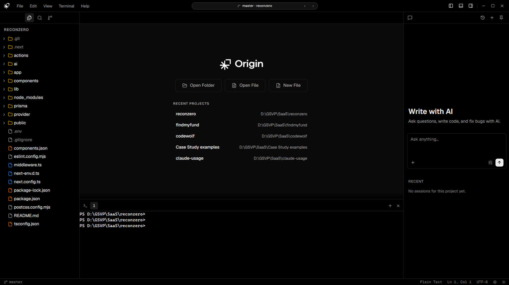
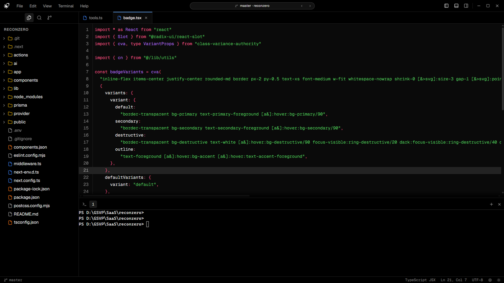
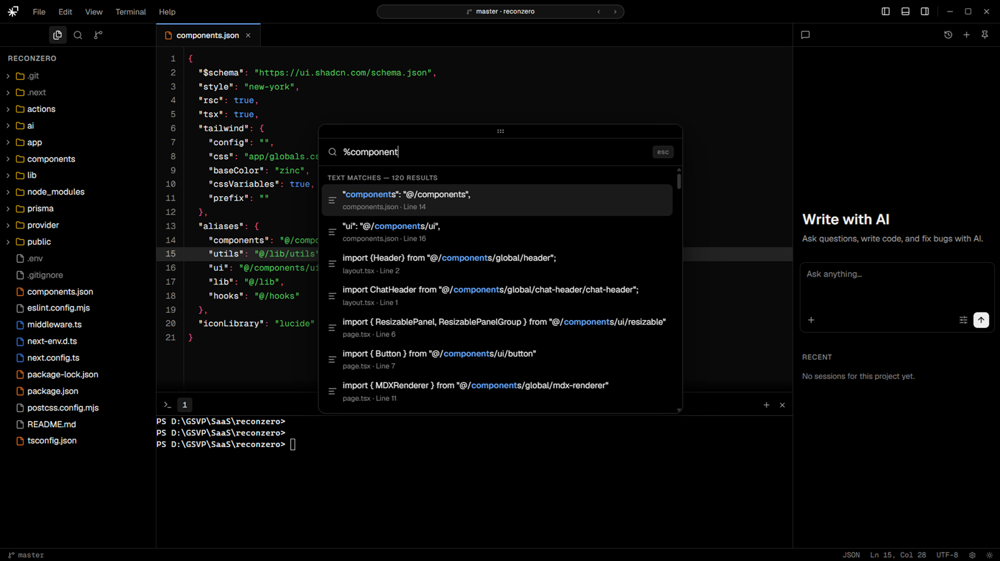

<p align="center">
  
</p>
<p align="center">
  A fast, agentic code editor built for AI-first development.<br/>
  Bring your own keys. Run everything locally.
</p>

<p align="center">
  
  
  
  
  
</p>

---

## Screenshots


<p align="center"><em>Welcome screen</em></p>
<details>
<summary>More screenshots</summary>
<br/>

<p align="center"><em>Code editor with syntax highlighting and integrated terminal</em></p>

<p align="center"><em>Command palette with fuzzy file search and AI panel</em></p>
</details>

---

## What is Origin?

Origin is a native desktop IDE built on Tauri 2 and React. It combines a full code editor, real terminal, and a deeply integrated AI panel into a single lightweight app. No subscriptions, no telemetry, no cloud lock-in. You bring your API keys; Origin does the rest.

The AI is not a sidebar afterthought. It has full agentic capabilities: it can read files, write code, run shell commands, and propose structured multi-step plans, all with your approval before anything touches disk.

---

## Features

### Editor
- **CodeMirror 6** with a fully custom theme driven by CSS variables
- Syntax highlighting for TypeScript, JavaScript, Rust, Python, CSS, HTML, JSON, Markdown
- Find & replace (`Ctrl+F` / `Ctrl+H`), per-tab cursor memory, dirty indicators
- Inline AI diff view with Accept / Reject, powered by `@codemirror/merge`
- New file, open file, save / save-as, close, all wired through the menu bar

### AI Panel
- **17 providers** - Anthropic, OpenAI, Gemini, OpenRouter, DeepSeek, Mistral, Groq, xAI, Cohere, Ollama, LM Studio, vLLM, and more
- **Bring Your Own Key** - keys stored in the OS keychain, never sent anywhere else
- **Agent mode** - full agentic loop using Vercel AI SDK v6; up to 24 tool-use steps per run
  - Auto-execute: `read_file`, `list_directory`, `grep`, `glob`
  - Approval-gated: `write_file`, `edit`, `bash_run`
- **Plan mode** - AI explores your codebase with read-only tools, proposes a structured plan with steps, then executes on your approval
- **Ask mode** - plain chat with editor context; no tools
- Inline diff tab per AI file edit, review the change before it hits disk
- SEARCH/REPLACE block engine for precise, multi-region code edits
- Markdown rendering with per-code-block Apply and Copy buttons
- `@` file mention and `+` multi-file attach
- Full chat session persistence via SQLite; session history; crash recovery

### Terminal
- Real PTY via `portable-pty` (Windows ConPTY)
- Multiple tabs, inline rename, persistent history across tab switches
- Theme sync, re-themes instantly when you switch IDE themes

### Status Island
- Persistent pill in the title bar that expands into an info card
- **Current Task** - set a task name, mark it complete, or clear it
- **What Changed** - live git status: files changed, commits ahead, recent log
- **Memory** - live system RAM usage
- **AI Spend** - token cost per model with a donut chart; reset anytime

### Source Control
- File status (M / A / D / U) with colored indicators
- Commit message + description form; Commit and Commit & Push
- Git history timeline with up to 100 commits, author, hash, and relative date

### Shell & Workspace
- Command palette (`Ctrl+P`) - fuzzy file search, `@` file mode, `%` full-text search, commands
- File tree with lazy-loading, right-click context menu (rename, delete, create, reveal)
- Find in files with debounced search, grouped results, and click-to-jump
- Settings panel - API keys, system prompt editor, theme switcher (`Ctrl+,`)
- Multi-window support

---

## Stack

| Layer | Technology |
|-------|-----------|
| Shell | Tauri 2.x |
| Frontend | React 19 + TypeScript |
| Styling | Tailwind CSS v4 |
| Fonts | Geist Sans + Geist Mono (bundled) |
| Editor | CodeMirror 6 |
| Terminal | `portable-pty` + xterm.js |
| AI Runtime | Vercel AI SDK v6 |
| HTTP Proxy | Rust `reqwest` (bypasses WebView2 CORS) |
| Persistence | `tauri-plugin-store` + SQLite (`tauri-plugin-sql`) |
| Secrets | OS keychain via `keyring` crate |
| Build | Vite 7 |

---

## Installation

Download the latest release from the [Releases](https://github.com/Origin-AI-IDE/origin/releases) page.

| Artifact                     | Description                                                                    |
| ---------------------------- | ------------------------------------------------------------------------------ |
| `Origin_x.x.x_x64-setup.exe` | NSIS installer (~5.8 MB)                                                       |
| `Origin_x.x.x_x64_en-US.msi` | MSI installer (~7.5 MB)                                                        |
| `origin.exe`                 | Portable standalone binary (requires WebView2, pre-installed on Windows 10/11) |

---

## Building from Source

**Prerequisites:** [Rust](https://rustup.rs/), [Node.js 20+](https://nodejs.org/), [Tauri CLI prerequisites for Windows](https://tauri.app/start/prerequisites/)

```bash
git clone https://github.com/Origin-AI-IDE/origin.git
cd origin
npm install
npm run dev        # dev mode (hot reload)
npm run build      # full release build + installers
```

---

## AI Providers

Origin supports any provider that speaks OpenAI-compatible SSE. Add your API key in Settings (`Ctrl+,`) → AI Providers. Keys are stored in the OS keychain.

| Provider | Type | Notable Models |
|----------|------|----------------|
| Anthropic | Cloud | Claude 3.5 Sonnet, Claude 3 Opus |
| Cohere | Cloud | Command R, Command R+ |
| DeepSeek | Cloud | DeepSeek V3, DeepSeek R1 |
| Google Gemini | Cloud | Gemini 1.5 Pro, Gemini Flash |
| Groq | Cloud | Llama 3, Mixtral (fast inference) |
| LM Studio | Local | Any GGUF model |
| Mistral | Cloud | Mistral Large, Codestral |
| Ollama | Local | Any model pulled locally |
| OpenAI | Cloud | GPT-4o, GPT-4 Turbo, o1 |
| OpenRouter | Cloud | 100+ models via unified API |
| vLLM | Local | Self-hosted inference server |
| xAI | Cloud | Grok-2, Grok Beta |

---

## Data & Privacy

- All AI requests route through a local Rust HTTP proxy, no third-party relay
- API keys live in your OS keychain
- Chat history is stored in a local SQLite database (`AppData\Roaming\com.originide.ide\`)
	- No telemetry, no analytics, no accounts

---

## License

Apache 2.0 - see [LICENSE](LICENSE)
